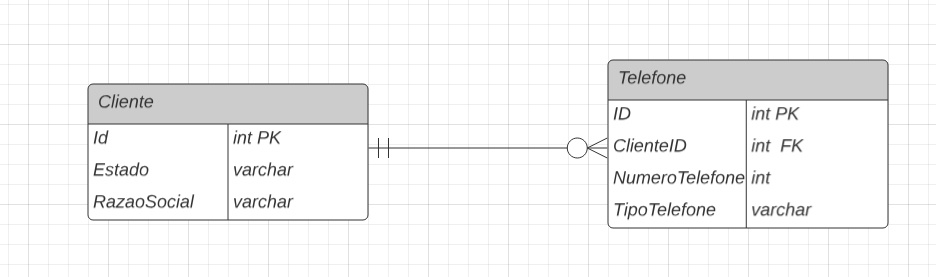

# Estrutura do banco de dados

## busca utilizando comando SQL

~~~~sql
SELECT 
    c.Id AS Codigo_Cliente, 
    c.RazaoSocial AS Razao_Social,
    GROUP_CONCAT(CONCAT(t.NumeroTelefone, ' (', t.TipoTelefone, ')') SEPARATOR ', ') AS Telefones
FROM 
    Cliente c
LEFT JOIN 
    Telefone t ON c.Id = t.ClienteID
WHERE 
    c.Estado = 'SP'
GROUP BY 
    c.Id, c.RazaoSocial;
~~~~